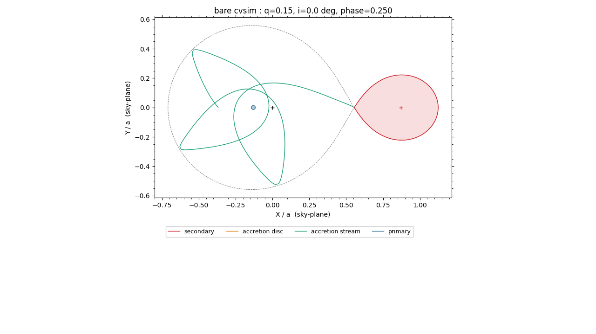
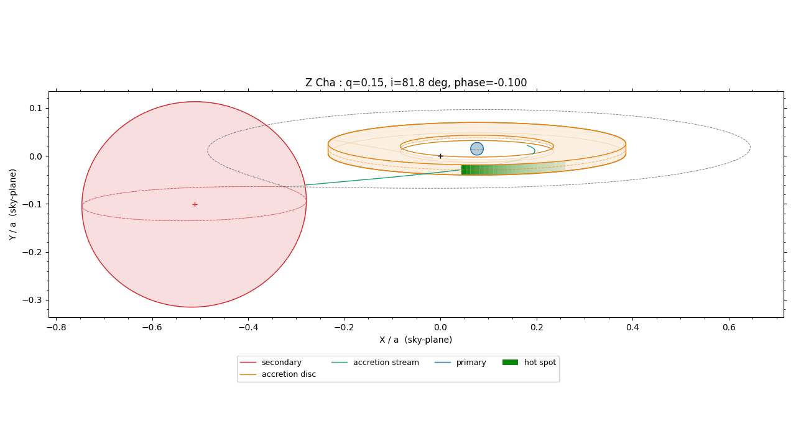
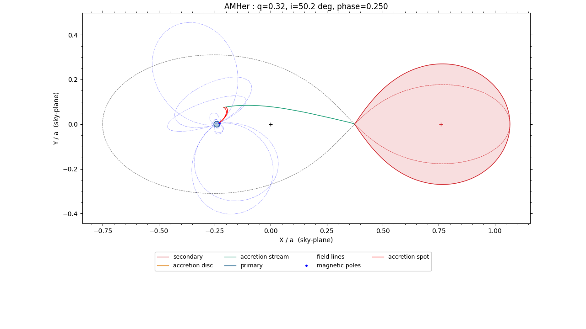
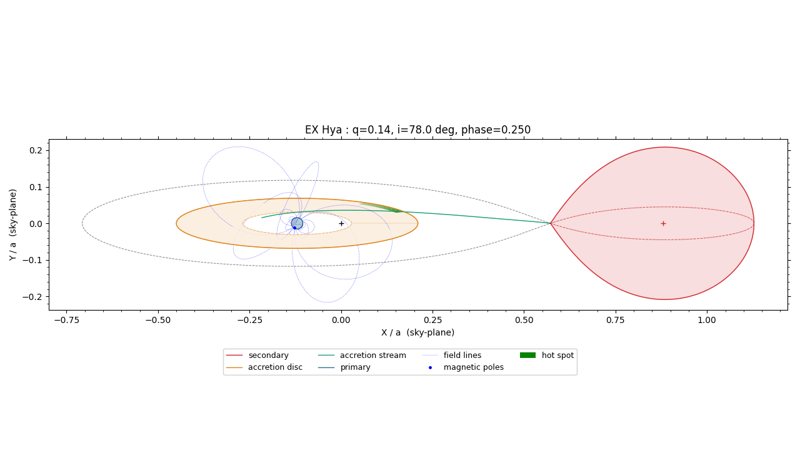

# cvsim

A Roche-lobe binary-star eclipse simulator for cataclysmic variables (CVs),
including magnetic CVs ("polars"). 

This collection of python scripts was written with the help of Claude Code
to be a tool for various tasks associated with the interpretation of observations of CVs, including
the graphical representation of the geometries, the calculation of realistic
lightcurves and radial velocity curves including the effects of
eclipses, fitting lightcurve or rv data, and even creating primitive
"photographic" images of the systems.

The main script -- simulation.py -- can either be invoked as a classic python
script or it can be run using a convenient GUI.  The parameters for a 
particular simulation are kept in YAML files that can be read either by the
script directly or indirectly via the GUI.

This document summarizes the physical
model, how the YAML config files work, the available
outputs, and the parameters behind every pane in those configs.

## 1. Physical background

Everything is computed in the frame **corotating** with the binary (units
`a=1`, `G(M1+M2)=1`, orbital angular velocity `Omega=1`, origin at the
center of mass); physical values (meters, Kelvin, seconds) only appear at
the config/CLI boundary and get converted internally.

- **Roche geometry** (`roche.py`) -- the primary (accretor) sits at
  `x1 = -q/(1+q)`, the secondary at `x2 = 1/(1+q)`, `q = M2/M1`. The
  secondary's surface is either its Roche lobe (the `Phi = Phi(L1)`
  equipotential through the inner Lagrangian point L1) or, if `R_2` is set
  below the lobe-filling volume-equivalent radius, a smaller detached
  star -- `R_2=0` (the default) always means exactly lobe-filling, the
  defining condition for a mass-transferring CV.
- **Accretion stream** (`stream.py`) -- a ballistic stream leaving
  the L1 nozzle is calculated following Lubow & Shu (1975). The initial velocity is set by
  the local sound speed, then integrated under gravity + Coriolis +
  centrifugal forces in the corotating frame. By default, the trajectory
  is drawn/used up to its first closest approach to the primary (a stand-in
  for "where the disc/field would take over"); `--stream_angle` can extend
  it further (even multiple loops around the primary) when the stream should
  be stopped at the disc rim or at particular magnetic field line, e.g. when a magnetic
  connection point lies beyond that first approach.  Note that the stream is not stopped
  by a disc by default, but the corresponding angle can be chosen to do so (so that
  overflow can be simulated).
- **Accretion disc** (`disc.py`, optional) -- considered only if `R_in`,
  `R_out`, `T_0`, and `beta_d` are *all* given. The rim is a Kepler
  ellipse focused on the primary (semi-major axis, eccentricity,
  periapsis angle), and surface temperature follows a radial power law
  `T(R) = T_0*(R/R_in)^beta_d`. A disc can optionally be given nonzero
  thickness defined by non-zero constant opening angle `beta_d`.
  If the `T_h` and `L_h`
  parameters are given, then a "hot spot" on the disc's outer rim starting
  at the accretion stream's impact point is created, where the 
  disc rim's temperature then exponentially decreases with an angular scale `L_h`
  until it reaches the disc's normal temperature. Note that - using this recipe -
  no hotspot emission is visible when i=0!
- **Magnetic channeling / "polar" accretion** (`magnetic.py`) -- used for
  simulating a system where the
  primary's magnetic field disrupts disc formation (AM Her being
  the prototype). The modelled field is a simple tilted dipole (obliquity `theta_1`,
  azimuth `phi_1`, ususally fixed in the corotating frame under the standard
  synchronous-rotation assumption). If an "accretion connection angle"
  (`angle_acc` -- how far around the primary, cumulative swept azimuth
  from L1, matching `stream_angle`'s own convention) is set, the ballistic
  stream is assumed to hand off to the field there, and the connecting
  field line carries material onward to a heated spot on the primary's
  surface -- this spot has its own angular size (`spot_acc`), temperature,
  and (independent) limb-darkening/brightening law, and irradiates the
  secondary like any other hot component.
- **Irradiation** (`irradiation.py`) -- full view-factor integrals (not a
  point-source approximation) for how much the disc/primary heat the
  secondary's surface, including partial occultation of the primary by
  the disc as seen from a given secondary point. This is the expensive
  part of a calculation, so it can be cached to a FITS file and reused
  (`--save-irradiation`/`--load-irradiation`).
- **Sky projection / eclipses** (`eclipse.py`) -- at phase 0 the secondary
  is between the primary and the observer (mid-eclipse convention). Every
  phase-dependent output projects the corotating-frame geometry onto the
  sky plane for the given inclination and tests occultation by the
  secondary's Roche lobe (and, if present, the disc).

## 2. Output possibilities (`--outputs`, comma-separated)

| Output | What it produces |
| --- | --- |
| `outline` | Sky-projected geometry (Roche lobe, disc, stream, dipole field-line loops, accretion-spot connection) at each requested phase -- one PNG per phase. |
| `temperature` | Rendered surface-temperature image (K) at each phase -- one PNG per phase. |
| `intensity` | Rendered surface-brightness image (band intensity, W/m^2/sr/m), the one that actually shows limb-darkening effects -- one PNG per phase. |
| `lightcurve` | The eclipse light curve as relative flux [mJy] vs. orbital phase, all phases on one plot, with a mirrored AB-magnitude axis; overlays observed data if `--data-file` is given. |
| `magnitude` | Same underlying computation as `lightcurve`, plotted with AB magnitude as the primary axis instead (whichever the observed data's own units are takes the primary axis automatically, when data is given). `lightcurve`/`magnitude` together (or either alone) also write one FITS binary table with both units, phase-resolved, plus every system/model parameter used in the header. |
| `shadow` | Top-down (face-on) view of the eclipse footprint: which parts of the disc/stream are shadowed/occulted, swept across the requested phase range. |
| `rv` | Radial-velocity curves (km/s) for the primary, secondary, accretion stream, and magnetically-channeled stream, computed *separately* (intensity-and-limb-darkening-weighted median line-of-sight velocity of each component's visible material), plus the two stars' circular Roche-point velocities as reference. Overlays observed RV data if any `--data_rv_*_col` is given. |
| `corner` | Not a `--outputs` choice itself -- produced automatically by `--mcmc_fit` when `--corner_plot` is set: the classic posterior pairwise-correlation plot. |

`--show` displays each output interactively instead of writing it to
`--outdir`. `--phase-num=1` (the default) uses a single phase;
`--phase-num>1` sweeps `linspace(--phase-min, --phase-max, --phase-num)` --
`outline`/`temperature`/`intensity` then write one file per phase, while
`lightcurve`/`magnitude`/`shadow`/`rv` always plot every phase together on
one figure regardless.

## 3. How the YAML config files work

Each config -- `examples/AMHer.yaml`/`examples/ZCha.yaml` (real systems, with
their own observed data under `examples/data/`) plus `simulate.yaml` (a
blank, field-by-field template for setting up a new system) -- is consumed
two ways:

- **`gui.py`** (a generic PySide6 form-builder that can be used for 
  running any python script) reads the *entire* file: a
  `script_path` (the script to run, resolved relative to the config file's
  own directory if not absolute), and a list of `panes`, each with a
  `title` and an `arguments` list. Each argument becomes one form field
  (`flag`, `label`, `type`, `default`, optional `tip`/`choices`), and
  pressing "Run" assembles `python <script_path> <flag1> <value1> ...`
  from whatever the form currently holds, using every field's live value
  -- not just the YAML's own recorded defaults.
- **`simulate.py --config file.yaml`** (bare CLI, no GUI) reads the same
  file but only pulls defaults for fields that are actual
  `SystemParams`/`ModelParams` dataclass fields (see `params.py`):
  `P_orb, a, q, R_1, T_1, T_2, incl, wavelength, u_1, u_2, R_2, ph_off,
  theta_1, phi_1` (SystemParams) and `R_in, R_out, T_0, beta_d, T_h, L_h,
  beta_grav, e_d, omega_d, alpha_d, u_d, angle_acc, spot_acc, T_acc, u_acc`
  (ModelParams).

**The gotcha:** every *other* field in a config -- `--outputs`,
`--phase-min/-max/-num`, `--n_areas_*`, `--n_field_1`, `--stream_angle`,
`--outdir`, `--prefix`, `--save-irradiation`/`--load-irradiation`, every
`--data*`/`--data_rv_*` flag, `--lsq_fit`/`--mcmc_fit` and its knobs,
`--no-irradiate`, `--workers`, `--pixelmapping`, `--image-size`,
`--vmin`/`--vmax` -- is a **plain** argparse flag, not a dataclass field.
A bare `python simulate.py --config file.yaml` does **not** pick up that
field's YAML default; those only take effect when the config is driven
through `gui.py`, or when you pass the flag explicitly on the command
line. (Every `SystemParams`/`ModelParams` field is also available as its
own `--<field_name>` flag on the plain CLI, config or not.)

## 4. Parameters by pane

### SYSTEM
The binary's physically "given" parameters:
- the simulation label/file prefix `prefix`;
- the orbital period `P_orb` [d];
- the orbital separation `a` [m];
- the mass-ratio `q` (M2/M1);
- the orbital inclination`incl` [deg];
- the distance `dist` [pc] (scales the light curve to a real flux density);
- the observed `wavelength` [Angstrom].

### PHASES
Shared by every phase-dependent output:
- the number of phases used `phase-num`;
- minimum & maximum phases `phase-min` and `phase-max` (a single phase is
  used if `phase-num`=1, else the sweep range).

### PRIMARY
Properties of the primary object:
- radius `R_1` [units of a];
- temperature`T_1` [K];
- limb-darkening coefficient `u_1` (governs how strongly the
  primary irradiates the secondary, so it's saved in an irradiation cache);
- number of surface areas `n_areas_1`;
- dipole obliquity and azimuth `theta_1` and `phi_1` [deg];
- number of cosmetic field-line loops `n_field_1`;
- `angle_acc` [deg] is a comma-separated list of accretion connection angle(s) -- define the
  around the primary, cumulative swept azimuth from L1
  places were the stream is tapped by the dipole field;
- `spot_acc` is the angular radius size of the resulting accretion spots on the surface of
  the primary; actually reached, to help pick a value;
- the accretion spot temperature `T_acc` [K] (should be > T_1);
- the accretion spot's limb-darkening/limb-brightening coefficient `u_acc`.

### SECONDARY
Properties of the secondary object:
- radius `R_2` [units of a] (0 = exactly Roche-lobe-filling; larger values are clipped to lobe-filling);
- temperature `T_2` [K];
- limb-darkening coefficient `u_2`;
- gravity-darkening exponent `beta_grav` (Lucy 1967);
- number of surface areas `n_areas_2`;

### DISC
Properties of the circum-primary disc (the disc is considered only if these properties are all given):
- inner radius`R_in`[units of a];
- outer radius `R_out` [units of a];
- temperature at R_in `T_0` [K];
- temperature power-law coefficient `beta_d` (temperature power-law index)
- number of surface areas `n_areas_d`.

Optional properties:
- disc half-opening angle `alpha_d` [deg] (0 = flat);
- outer disc eccentricity `e_d` (0 = circular);
- douter disc "periastron" orientation`omega_d` [deg];
- disc limb-darkening coefficient `u_d`.

### STREAM
Properties of the accretion stream:
- hot spot impact temperature `T_h` [K];
- hot spot angular scale `L_h` (The hot spot extends beyond the impact point
  with a temperature that decreases as T = T_h exp(-(phi-phi_impact)/L_h);
- the angular extent`stream_angle` [deg], measured from the secondary in the
  direction of the stream (default is stopping at the outer disc or the radius
  of closest approach, but stream_angle can be > 360 to let the stream go around multiple times);

### OUTPUT
Parameters controlling the output:
- `outputs` is a comma-separated list of options shown in Section 3;
- `show` is a flag which indicates whether the output should be displayed or
  saved in a file;
- `show-points` is a flag used for displaying the surface points of all bodies (useful to 
  determine an optimal resolution);
- `outdir` is the optional output directory;
- `save-irradiation`/`load-irradiation` read/writes a FITS cache of the expensive
  irradiation calculation -- loading one only lets `wavelength`/`u_2` still
  safely vary; anything else that would change the cached irradiation is
  ignored with a warning).

### DATA
Parameters describing the use of external data files:
- `ph_off` is the phase offset applied to the data (corrects a bad ephemeris in the data, not the model!);
- `data-file` is the CSV/FITS file containing photometric data;
- `data-phase-col` is the label of the phase column in data-file;
- `data-flux-col` is the label of the flux column;
- `data-mag-col` is the label of the magnitude column;
- `data-err-col` is the label of the error column;
- `data-rv-file` is the CSV/FITS file containing RV data (defaults to `data-file` if blank);
- `data-rv-phase-col` is the label of the phase column in data-rv-file;
- `data_rv_1` is the label of the primary RV column;
- `data_rv_2` is the label of the secondary RV column;
- `data_rv_stream` is the label of the stream RV column;
- `data_rv_hotspot` is the label of a magnetially channeled stream RV column;
- `data_rv_gamma` is the systemic-velocity offset [km/s] added to every model RV curve
  before comparing to any of the above (the model itself has zero systemic velocity).

### FIT
Parameters controlling the fitting of simulations with observed data:
- `data_norm` is a multiplicative flux factor or additive magnitude offset
  applied to the data to adjust the levels to the simulation;
- `lsq_fit` or `mcmc_fit` are lists of simulation parameters that should be fit, using either
 a least-squares or MCMC optimisation, respectively;
- `nburn` is the nummber of burn-in MCMC samples;
- `nsample` is the number of finale MCMC samples;
- `walkers` is the ratio of MCMC walkers per parameter;
- `spread` is the starting dispersion used to initialize the MCMC sampling;
- `corner_plot` is a flag to indicate that an MCMC corner plot is desired.

### MISC
Various parameters affecting the simulation:
- `no-irradiate` is a flag indicating if the irradiation of all surface areas should be
  performed or not;
- `workers` is the number of processes used to parallize the calculations (machine dependent!);
- `pixelmapping` (`direct` vs.  `indirect` sample-to-pixel rendering strategy);
- `image-size` is the output PNG pixel dimensions NxM;
- `vmin` and `vmax` are the colorbar limits for the temperature/intensity rendering.

## 5. Examples

The three configs under `examples/` represent real systems, each set up to show
off a different part of the model. The images below are each config's own
default `outline` output -- every field left at its own recorded YAML
default (the same values `gui.py` would show on load), saved to
`examples/outputs/` -- no fitting, no observed-data overlay, just the
geometry.

### bare cvsim

This is a bare-bones CV simulation with a semi-detached secondary and
a free-falling accretion stream.  Note that the lack of an accretion disc
(and the large value of the angular extent of the stream in the config file)
lets the stream orbit around the non-magnetic primary several times.

### Z Cha

A classic non-magnetic eclipsing dwarf nova with an accretion stream
exiting the inner Lagrange point, an accretion disc, and a "hot spot" created
by the impact of the stream on the disc
(shown here symbolically as the green areas fading around the outer rim),
all viewed close to the
secondary eclipse (`phase=-0.1`) where the disc's near side is
partially hidden behind the secondary.

### AM Her

The prototype magnetic CV ("polar"): the secondary overflows its Roche
lobe, but there is **no disc** -- the primary's tilted dipole field
(`theta_1`/`phi_1`, the dotted blue loops) instead channels the ballistic
stream directly onto a hot spot on the primary's surface (the small red
arc; `angle_acc`/`spot_acc`/`T_acc`). 

The config file is bundled with a link to real AAVSO/Kafka et al (2005)
V-band photometry (`./examples/data/`): to produce a lightcurve, simply
- change the output to "magnitude" (lightcurve for data in magnitudes),
- change the displayed phases from a single phase to multiple phases (e.g.
101 points from phase -0.5 to 0.5), and run again.

### EX Hya

An intermediate polar: unlike AM Her, EX Hya has a real accretion disc
with its own stream-impact hot spot
*and* a magnetic primary -- this config shows
the disc/stream geometry together with the dipole field-line loops as a
cosmetic overlay (no `angle_acc` is set here, so the stream isn't actually
routed onto the field in this particular default view).

